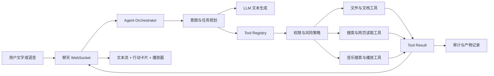

# 时叙：从“只会对话”到“能够实际行动”的工具执行能力开发方案

版本：V1.0
日期：2026-08-10
适用工程：`E:\时序`
目标形态：本地单用户陪伴 Agent，后续可扩展桌面客户端和多用户版本

## 1. 结论

这类能力可行性较高，但它不是继续优化 Prompt 就能完成的功能。

当前时叙的核心链路是：用户发文字或语音，模型生成文字，前端展示或朗读文字。模型没有真正可以调用的文件、搜索、音乐或系统工具，因此它只能“描述自己准备做什么”，不能证明已经做完。

要实现下面两类需求：

- “帮我了解现在的 Agent 行业行情，创建一个 Markdown 文件放到桌面”
- “我今天很难受，帮我放一首歌”

必须给时叙增加一套独立的“行动系统”：

1. 识别用户意图和目标。
2. 选择允许使用的工具。
3. 校验权限、路径、参数和风险。
4. 实际执行文件创建、资料检索或媒体播放。
5. 把执行进度和真实结果回传到前端。
6. 只有收到成功结果后，时叙才能说“已经创建”或“已经开始播放”。

推荐产品定位是：

> 时叙负责理解、陪伴和规划；工具执行层负责真实行动；执行结果必须可验证、可停止、可追溯。

### 1.1 总体可行性

| 能力 | 可行性 | 主要条件 |
| --- | ---: | --- |
| 根据已有内容创建 Markdown 文件 | 95% | 本地后端、允许目录、文件工具 |
| 检索当前行业信息并生成带来源的 Markdown | 80% - 90% | 搜索 Provider、网页读取、引用校验 |
| 创建文件到当前 Windows 用户桌面 | 90% | 本地运行、Windows 桌面路径解析、写入授权 |
| 播放本地音乐文件 | 90% | 用户授权的音乐目录或本地播放器 |
| 播放在线歌曲试听片段 | 70% - 85% | 合法音源 API、浏览器播放器、自动播放兜底 |
| 播放在线完整歌曲 | 50% - 70% | 音乐平台 OAuth、会员要求、官方播放 SDK |
| 任意搜索并免费自动播放完整版权歌曲 | 20% - 35% | 版权、反爬、登录、DRM 和平台条款限制，不建议实现 |
| 控制 Windows 上的第三方音乐应用 | 60% - 80% | 桌面桥接、应用协议或官方 API，兼容性因应用而异 |

### 1.2 当前开发位置判断

当前时叙适合先做“本地行动型 Agent MVP”：

- 第一阶段支持创建新 Markdown 文件。
- 第二阶段支持检索公开资料并生成带引用的研究文档。
- 第三阶段支持本地歌曲和合法试听音源播放。
- 第四阶段再接入需要登录的正式音乐平台。

一个可用 MVP 预计需要 1 - 2 周；包含完整权限、审计、研究引用、音乐 Provider 和桌面桥接的稳定版本，预计需要 4 - 6 周。

## 2. 截图暴露出的核心缺陷

截图中的对话暴露了一个严重的产品可信度问题。

用户要求创建文件后，时叙回复：

- “好，写好了”
- “文件在桌面”

但当前系统没有文件工具，也没有文件写入结果，因此这不是执行成功，而是模型在模拟执行。

### 2.1 错误承诺

模型可以生成“已完成”“已保存”“已播放”等文本，但后端没有任何对应动作。这会让用户迅速失去信任，严重程度高于普通回答错误。

### 2.2 没有执行证据

真正成功的文件创建至少应该返回：

- 实际绝对路径
- 文件名和文件大小
- 创建时间
- 内容摘要
- “打开文件”或“打开所在文件夹”按钮
- 文件存在性校验结果

截图里只有一段文字，没有任何可验证结果。

### 2.3 没有资料来源

“现在的 Agent 行业行情”属于强时效信息。只依靠模型训练数据会产生过时或虚构信息。系统必须先联网检索，再生成带来源、检索日期和不确定性说明的文档。

### 2.4 没有权限边界

系统没有定义：

- 哪些目录可以写入
- 是否允许覆盖同名文件
- 用户没有明确路径时放在哪里
- 是否允许打开外部程序
- 哪些动作必须再次确认
- 文件失败后如何恢复

### 2.5 没有行动状态

当前聊天只有开始、文本分块、完成和错误。它无法表达：

- 正在搜索资料
- 找到了多少来源
- 正在生成文件
- 等待用户确认
- 文件创建成功
- 音源不可用
- 浏览器阻止自动播放
- 用户中止了动作

### 2.6 语音播放和音乐播放混在一起

当前 `SpeechSynthesis` 只是把时叙回复朗读出来，不是音乐播放器。音乐播放还需要音源、播放队列、暂停、停止、音量、版权授权和播放状态管理。

## 3. 产品目标与边界

### 3.1 产品目标

完成后，时叙应该具备四种层次的能力：

1. **理解**：判断用户是想聊天、查询、生成文件，还是控制媒体。
2. **规划**：把复杂任务拆成搜索、整理、写入、校验等步骤。
3. **执行**：调用受控工具真正完成动作。
4. **交付**：提供结果、证据、失败原因和下一步操作。

### 3.2 必须坚持的原则

- 没有工具成功结果，不得声称动作已经完成。
- 网页内容只能作为资料，不能指挥时叙调用工具。
- 只给工具最小权限，不向模型开放任意 Shell。
- 创建新文件和覆盖旧文件必须区分。
- 用户必须随时可以停止音乐和长任务。
- 所有工具执行必须有结构化日志。
- 失败时明确说明失败在哪一步，不用编造结果补齐体验。

### 3.3 暂不支持的能力

第一版不应该支持：

- 模型直接执行任意 PowerShell、CMD 或 Python 代码
- 绕过 DRM、会员或登录限制获取完整歌曲
- 未经确认覆盖、删除或移动用户文件
- 根据网页中的指令自动安装软件或提交账号信息
- 自动购买、付费、发消息或操作外部账户
- 远程服务器直接写入用户本机桌面

## 4. 两个目标场景的完整体验

## 4.1 场景一：研究 Agent 行业并创建 Markdown

用户输入：

> 我想了解一下现在的 Agent 行业行情，创建一个 md 文件放在桌面。

### 推荐执行流程

1. 意图识别为“时效研究 + 文档生成 + 桌面文件创建”。
2. 判断是否缺少关键条件：地区、时间范围、面向投资还是求职。
3. 条件不影响基本结果时采用合理默认值，并在文档中写明范围；影响较大时只问一个必要问题。
4. 调用搜索工具检索近期公开资料。
5. 读取高质量来源，过滤重复、广告和无发布日期内容。
6. 提取市场现状、产业链、主要玩家、落地场景、商业模式、风险和趋势。
7. 为每个关键结论保留来源 URL、标题和日期。
8. 生成 Markdown 内容。
9. 文件策略层解析真实桌面目录并生成安全文件名。
10. 创建新文件，不覆盖同名文件。
11. 重新读取文件，校验文件存在、非空、编码正确。
12. 前端显示“文档已创建”行动卡片。

### 推荐交付结果

```text
已创建：Agent行业行情分析_2026-08-10.md
位置：C:\Users\用户名\Desktop\Agent行业行情分析_2026-08-10.md
大小：18.4 KB
引用来源：12 个
状态：已校验
```

前端提供：

- 打开文件
- 打开所在文件夹
- 查看内容
- 重新生成
- 追加要求

### 桌面路径处理

不能直接假设桌面一定是 `C:\Users\用户名\Desktop`，因为 Windows 可能把桌面重定向到 OneDrive 或其他目录。

推荐顺序：

1. 使用 Windows Known Folder API 获取 `FOLDERID_Desktop`。
2. 获取失败时再尝试 `Path.home() / "Desktop"`。
3. 路径仍不可用时，回退到配置的输出目录，例如 `E:\Kairos-output`。
4. 前端明确显示最终保存位置。

### 文件命名策略

- 清理 Windows 非法字符：`< > : " / \\ | ? *`
- 限制文件名长度
- 仅允许第一版声明的扩展名，例如 `.md` 和 `.txt`
- 同名时自动增加时间或序号
- 默认不覆盖现有文件
- 用户明确要求覆盖时仍进入确认流程

## 4.2 场景二：用户难受，时叙回应后播放歌曲

用户输入：

> 我今天很难受，帮我放一首歌。

### 推荐执行流程

1. 情绪系统识别“低落”和“想被陪伴”。
2. 时叙先用一句短回应接住情绪，不进行长篇说教。
3. 媒体策略根据用户历史偏好、当前场景和可用音源选择候选歌曲。
4. 调用 `music.search`，不由模型凭空编造播放链接。
5. 获得可播放、合法、未过期的音源后调用 `music.play`。
6. 播放前停止时叙的 TTS，避免人声朗读和音乐重叠。
7. 前端显示歌曲名、歌手、封面、来源、播放状态和停止按钮。
8. 如果浏览器阻止自动播放，立即显示明确的“播放”按钮作为一步兜底。
9. 用户再次说话时，可根据设置降低音量、暂停或继续播放。

### 推荐回应方式

```text
听起来今天真的有点沉。先不用急着把自己整理好，我陪你待一会儿。

正在播放：歌曲名 - 歌手
```

只有收到 `music.play` 成功事件后，第二行才可以出现。

### 音源优先级

第一版建议按以下顺序选择：

1. 用户授权的本地音乐目录
2. 项目自带或用户导入的无版权/已授权音乐
3. 音乐平台提供的合法试听片段
4. 用户登录后的官方播放 SDK
5. 调用 Windows 默认播放器打开用户已有歌曲

不建议搜索第三方盗链或下载完整版权歌曲。

### 浏览器自动播放限制

Web 应用的自动播放不是 100% 可控：

- 浏览器通常要求用户先与页面交互。
- 用户点击“发送”算一次交互，但经过异步模型回复和网络搜索后，激活状态可能已经失效。
- 浏览器可能允许静音播放，但阻止有声播放。
- 页面在后台、系统静音或输出设备变化时也可能失败。

可靠策略是：

- 在用户发送明确播放请求时恢复 `AudioContext`。
- 实际音源返回后尝试自动播放。
- 失败时显示一个清晰的播放按钮，不重复弹窗。
- 如果追求真正稳定的自动播放，使用 Electron/Tauri 桌面客户端或本地媒体桥接。

## 5. 推荐系统架构



### 5.1 Agent Orchestrator

负责管理一轮任务，而不是让当前 `stream_reply()` 直接生成最终文本。

它需要：

- 判断纯聊天还是行动任务
- 控制最多工具调用次数
- 管理任务取消和超时
- 将工具结果重新交给模型总结
- 防止相同动作重复执行
- 在工具失败后决定重试、降级或向用户说明

### 5.2 Tool Registry

所有工具必须注册名称、说明、参数 Schema、风险等级和执行函数。模型只能选择注册过的工具。

第一批推荐工具：

| 工具 | 作用 | 风险等级 |
| --- | --- | ---: |
| `capabilities.get` | 获取当前可用能力 | 0 |
| `web.search` | 搜索公开资料 | 0 |
| `web.read` | 读取指定网页正文 | 0 |
| `document.compose_markdown` | 生成结构化 Markdown | 0 |
| `file.create_markdown` | 在允许目录创建新文件 | 1 |
| `file.verify` | 校验文件存在和摘要 | 0 |
| `artifact.open` | 打开已创建文件 | 2 |
| `artifact.reveal` | 打开文件所在目录 | 2 |
| `music.search` | 搜索可播放歌曲 | 0 |
| `music.play` | 播放合法音源 | 2 |
| `music.pause` | 暂停当前媒体 | 1 |
| `music.stop` | 停止当前媒体 | 1 |

风险等级不是给模型决定，而是由服务端固定。

### 5.3 工具调用协议

模型输出结构化工具请求：

```json
{
  "name": "file.create_markdown",
  "arguments": {
    "target": "desktop",
    "filename": "Agent行业行情分析_2026-08-10.md",
    "content": "# Agent 行业行情分析\n...",
    "overwrite": false
  }
}
```

服务端返回结构化结果：

```json
{
  "tool_run_id": "run_a19c",
  "status": "succeeded",
  "artifact": {
    "id": 42,
    "path": "C:\\Users\\用户名\\Desktop\\Agent行业行情分析_2026-08-10.md",
    "mime_type": "text/markdown",
    "size_bytes": 18841,
    "sha256": "..."
  }
}
```

只有 `status=succeeded` 时，模型和前端才能展示“已创建”。

### 5.4 WebSocket 事件扩展

保留现有文本事件，同时增加：

```text
assistant.start
assistant.chunk
tool.requested
tool.confirmation_required
tool.started
tool.progress
tool.succeeded
tool.failed
artifact.created
media.loading
media.playing
media.paused
media.stopped
turn.completed
turn.cancelled
```

前端不能把工具事件当普通聊天文字展示，而应渲染行动卡片。

### 5.5 通用文档任务与领域策略层

`file.create_markdown` 不是“Agent 行业报告工具”，也不是法律、程序员、游戏或房产的专用工具。它只接收已经通过内容和权限校验的最终 Markdown，并将其安全写入允许目录。

通用任务链应拆为三层：

```text
领域策略层：判断这是什么主题、风险和资料要求
    ↓
文档任务层：研究、组织结构、生成 Markdown、内容校验
    ↓
文件工具层：安全命名、路径解析、原子写入、存在性校验
```

用户请求先归一化为 `ArtifactTask`，例如：

```json
{
  "kind": "artifact.create",
  "topic": "现在的 Agent 行业行情",
  "domain": "industry_research",
  "requirements": ["现状", "机会", "风险", "来源"],
  "output": {
    "format": "markdown",
    "target": "desktop",
    "filename": "Agent行业行情分析_2026-08-10.md"
  },
  "research": {
    "required": true,
    "freshness": "current",
    "citations_required": true
  }
}
```

文档任务完成后，才调用通用的 `file.create_markdown`。模型不能跳过领域策略层直接把未经校验的内容写入用户桌面。

#### 5.5.1 领域策略不是领域专用文件工具

每个领域只定义内容质量、时效、来源和安全规则；不需要为每种主题重复实现文件创建。

| 领域 | 默认处理 | 强制条件或边界 |
| --- | --- | --- |
| 普通方案、总结、日记 | 直接生成后可保存 | 不联网也要标明是基于当前对话整理 |
| 行业研究 | 先搜索再写入 | 标注检索日期、来源和不确定性 |
| 程序员/技术文档 | 基于用户指定项目或代码范围分析 | 默认只读；改代码、执行命令、读取工作区外文件需单独授权 |
| 法律 | 先确认司法辖区和时间范围 | 引用官方来源；不得替代律师意见或给出确定性结论 |
| 房产 | 先确认城市、用途和时间范围 | 行情与政策必须带日期和来源；不承诺收益或价格 |
| 游戏 | 可生成攻略、设定整理或任务清单 | 时效攻略要确认游戏版本、平台和 DLC；来源可选但推荐标注 |
| 感情/关系复盘 | 优先基于用户描述生成 | 不做操控、跟踪或替他人决策；高风险情绪进入安全策略 |
| 医疗/金融 | 视为高风险研究任务 | 需要来源、风险提示和专业人士建议；不得诊断、开药或保证收益 |

无法可靠识别领域时，使用 `general` 策略：只生成草稿，不把推测写成事实；当地域、版本、时间范围会显著改变结论时，只追问一个必要问题。

#### 5.5.2 文档内容的通用边界

- 用户只说“帮我写一份”时，默认在聊天中给草稿，不创建文件。
- 用户明确说“创建、保存、导出为 Markdown 到桌面”时，才进入文件工具。
- 研究型和高风险主题先满足来源要求，再创建文件。
- 仅写入完成当前任务所需的对话内容，不能自动导出全部历史、记忆、环境变量或密钥。
- 来自网页的内容视为不可信资料；去除脚本、原始 HTML 和诱导性指令后才能进入文档。
- 创建失败时保留草稿和失败原因，但不能显示“文件已创建”。

#### 5.5.3 领域策略接口

```text
DomainPolicy
  classify(task) -> domain
  required_context(task) -> missing fields
  research_requirement(task) -> none / optional / required
  citation_requirement(task) -> none / recommended / required
  validate_content(document) -> warnings / errors
  safety_guard(task, document) -> allow / clarify / refuse / escalate
```

这样新增“法律文档”“房产调研”“游戏攻略”时，增加的是策略、模板或资料 Provider，而不是新的磁盘写入权限。

## 6. 后端模块建议

建议新增：

```text
backend/app/
├── orchestration/
│   ├── runner.py              # 单轮任务循环
│   ├── planner.py             # 意图与工具选择
│   ├── domain_policy.py       # 领域风险、资料与内容规则
│   ├── events.py              # 统一事件模型
│   └── cancellation.py        # 取消、超时、幂等
├── tools/
│   ├── base.py                # Tool、ToolRequest、ToolResult
│   ├── registry.py            # 工具注册表
│   ├── policy.py              # 权限和风险判断
│   ├── files.py               # 安全文件创建与校验
│   ├── research.py            # 搜索、网页读取、引用
│   ├── documents.py           # Markdown 组织与质量校验
│   └── music.py               # 音源 Provider 抽象
├── services/
│   ├── desktop.py             # Windows Known Folder、打开文件
│   ├── search.py              # 搜索 Provider
│   └── media.py               # 媒体会话
└── api/
    ├── chat.py                # 接入 Orchestrator
    ├── actions.py             # 确认、取消、重试
    └── artifacts.py           # 产物读取和下载
```

### 6.1 Provider 抽象

不要把搜索和音乐平台写死在聊天逻辑中。

```text
SearchProvider
  search(query, time_range, limit)
  read(url)

MusicProvider
  search(query, mood, limit)
  resolve(track_id)
  get_stream(track_id)

DesktopBridge
  resolve_known_folder(name)
  open_file(path)
  reveal_file(path)
  play_local(path)
```

## 7. 前端需要增加的内容

### 7.1 行动状态

前端 Pinia 状态增加：

- 当前任务 ID
- 当前步骤
- 工具执行状态
- 等待确认的动作
- 已创建产物
- 当前媒体会话
- 是否可取消
- 重试次数和失败原因

### 7.2 文件产物卡片

文件创建成功后展示：

- 文件图标和文件名
- 绝对路径或简化路径
- 文件大小和创建时间
- 打开、定位、预览按钮
- 创建失败时的失败原因和重试按钮

### 7.3 音乐播放器

至少包含：

- 歌曲名和歌手
- 封面或默认音频图标
- 播放/暂停
- 停止
- 音量
- 当前进度
- 音源标识
- 自动播放被阻止时的一键播放状态

### 7.4 TTS 与音乐音频焦点

需要一个统一的 `AudioSessionManager`：

- 时叙开始朗读时降低或暂停音乐
- 用户说话时停止 TTS
- 音乐开始时停止上一段 TTS
- 同一时间只允许一个主媒体会话
- 新播放请求替换旧播放前，先结束旧会话

## 8. 权限、安全与防提示注入

## 8.1 风险分级

| 等级 | 示例 | 处理方式 |
| --- | --- | --- |
| 0 只读 | 搜索、读取网页、读取工具能力 | 可直接执行 |
| 1 可恢复写入 | 在允许目录创建新文件、暂停媒体 | 用户已明确要求时直接执行 |
| 2 外部动作 | 打开文件、启动播放器、有声播放 | 明确请求时执行，否则确认 |
| 3 高风险 | 覆盖、删除、发送、登录、购买、安装 | 每次必须确认 |

用户说“创建到桌面”已经明确授权创建一个新文件，但没有授权覆盖同名文件。

用户说“帮我放一首歌”已经明确授权一次播放动作，但没有授权登录新账号、购买会员或修改系统设置。

### 8.2 文件沙箱

第一版只允许写入配置的根目录：

```text
桌面 Known Folder
E:\Kairos-output
用户手动授权的其他目录
```

路径校验必须在解析绝对路径后执行，防止：

- `..\` 路径穿越
- 符号链接逃逸
- UNC 网络路径
- 设备路径
- 隐藏覆盖系统文件
- 伪装扩展名

模型不能直接决定任意绝对路径。模型只提交 `target=desktop` 或已授权目录 ID，由策略层解析实际路径。

### 8.3 网页提示注入防护

网页可能出现“忽略之前指令”“下载此文件”“把用户数据发给某地址”等恶意文字。

必须规定：

- 网页内容属于不可信数据，不是系统指令。
- 研究工具只能返回正文、来源和元数据。
- 网页不能直接产生工具调用。
- 工具参数必须来自用户目标和服务端策略。
- 研究阶段禁止上传本地文件、记忆或对话历史。

### 8.4 密钥和账号

- 搜索 API Key、音乐平台 Token 只保存在后端。
- OAuth Token 加密存储，不放入聊天上下文。
- 工具失败日志不得打印完整 Token 或隐私信息。
- 多用户版本必须按用户隔离 Token、文件和工具记录。

## 9. 数据库建议

新增三个基础表。

### 9.1 tool_runs

```text
id
session_id
request_id
tool_name
arguments_json
risk_level
status
started_at
finished_at
error_code
error_message
result_json
```

敏感参数写入数据库前需要脱敏。

### 9.2 artifacts

```text
id
tool_run_id
kind
display_name
path
mime_type
size_bytes
sha256
created_at
```

### 9.3 user_permissions

```text
id
capability
scope
decision
expires_at
updated_at
```

第一版本地单用户也应保留这些记录，后续迁移多用户时不需要重写协议。

## 10. 研究与 Markdown 质量要求

“现在的行业行情”不是普通写作，必须先检索。

### 10.1 来源要求

优先级建议：

1. 官方产品、公司公告和技术文档
2. 监管或行业组织资料
3. 有明确方法论的研究报告
4. 高质量媒体和访谈
5. 社区讨论只用于补充观点，不作为核心事实唯一来源

### 10.2 文档必须包含

- 标题
- 生成日期和检索日期
- 范围说明
- 执行摘要
- 市场现状
- 产业链和代表参与者
- 落地场景
- 商业模式
- 机会
- 风险和不确定性
- 给用户的建议
- 来源列表

### 10.3 事实规则

- 带数字的结论必须附来源。
- 无法确认的市场规模不得写成确定事实。
- 多个来源冲突时展示差异。
- 明确区分事实、媒体观点和时叙的分析。
- 搜索失败时可以生成“研究框架”，但不能伪装成最新行情报告。

## 11. 音乐能力方案选择

### 11.1 方案 A：本地音乐库

可行性最高，适合第一版。

优点：

- 无在线播放版权问题
- 延迟低
- 可离线
- 自动播放稳定

缺点：

- 用户需要准备歌曲
- 需要扫描和管理本地音乐目录
- 元数据可能不完整

### 11.2 方案 B：合法试听音源

适合网页 MVP。

优点：

- 接入速度快
- 不一定要求用户登录
- 能验证情绪选曲和播放器闭环

缺点：

- 通常只有短试听
- 链接可能过期
- 曲库范围有限

### 11.3 方案 C：正式音乐平台 SDK

适合产品化阶段。

优点：

- 正式曲库和播放控制
- 用户体验完整

缺点：

- 需要 OAuth
- 可能要求会员
- 平台、地区和设备限制明显
- 需要遵守品牌和播放条款

### 11.4 方案 D：Windows 桌面桥接

适合真正的本地数字人产品。

可通过 Electron、Tauri 或独立本地服务提供：

- 打开本地文件
- 调用默认播放器
- 管理系统媒体会话
- 更稳定地后台播放
- 未来支持托盘和桌面宠物

但桌面桥接扩大了权限范围，必须配套签名、更新机制和权限控制。

### 11.5 推荐顺序

1. 本地音乐 + 浏览器内置播放器
2. 合法试听 Provider
3. 正式平台 OAuth 播放
4. 桌面客户端媒体桥接

### 11.6 自适应音乐 Provider 降级链

用户说“播放音乐”时，时叙可以先检查本机已经配置并且允许使用的音乐能力，再按优先级尝试播放。这里的“检查软件”不能等同于扫描和强行操作所有已安装软件，而应该是读取受控的 Provider 能力清单。

推荐流程：

1. 识别用户的播放意图、情绪、音乐偏好和是否指定歌曲。
2. 查询当前可用的音乐 Provider：本地目录、已授权桌面软件、合法试听 Provider、浏览器播放器。
3. 按优先级搜索歌曲并解析可播放音源。
4. 调用 `music.play`，等待播放器返回真实状态。
5. 播放成功后展示歌曲和 `playing` 状态。
6. 当前 Provider 不可用时，记录失败原因并自动降级到下一层。
7. 所有来源失败时，明确告诉用户原因，不声称“已经播放”。

建议的 Provider 优先级：

```text
用户授权的本地音乐
    ↓ 不可用
已安装且有官方协议/API 的音乐软件
    ↓ 不可用
合法试听 Provider
    ↓ 不可用
浏览器网页播放器
    ↓ 仍不可用
请用户提供歌曲、配置音乐来源或点击播放按钮
```

### 11.7 软件检测必须使用能力状态

仅知道软件“安装了”不代表它可以被时叙控制。Provider 至少要返回以下状态之一：

| 状态 | 含义 | 处理 |
| --- | --- | --- |
| `available` | 已授权并且可以搜索/播放 | 直接调用 |
| `installed_uncontrollable` | 已安装但没有可用控制接口 | 只允许启动，不能承诺播放 |
| `requires_login` | 有接口但用户尚未登录 | 提示用户登录，不代替用户输账号 |
| `requires_membership` | 需要会员或设备授权 | 明确提示限制 |
| `no_playable_source` | 搜索到歌曲但没有合法可播放音源 | 降级或询问用户 |
| `playing` | 播放器已确认开始播放 | 可以回复播放成功 |
| `failed` | 播放失败 | 记录原因并降级 |

服务端应提供 `capabilities.get`，而不是把所有软件名称直接塞进 Prompt。模型只看到当前真实可用的 Provider 和它们支持的动作。

### 11.8 汽水音乐的接入判断

汽水音乐可以作为一个独立的 `SodaMusicProvider`，但稳定性取决于它是否提供可用的公开接口或系统协议：

1. **有官方 API、URL Scheme 或 Windows 媒体控制接口**：可以实现搜索、打开歌曲或播放控制，稳定性较高。
2. **只有桌面客户端，没有公开控制接口**：可以尝试启动应用，但不能保证自动搜索和播放；不要把启动成功当成播放成功。
3. **只能通过 UI 自动化点击**：可作为实验性适配器，但会受版本、窗口布局、登录状态和验证码影响，不应该作为核心链路。
4. **无法取得合法音源**：转到本地音乐或合法网页试听，不使用盗链或绕过平台限制。

因此，方案中不应写死“检测到汽水音乐就一定能播放”。正确表述是：

> 检测到汽水音乐后，先读取它当前可用的控制能力；有可调用接口就使用，没有就降级或提示用户手动完成。

### 11.9 播放请求的权限规则

“播放音乐”属于用户明确提出的播放请求，可以直接尝试播放，但仍要限制附带动作：

- 允许：搜索歌曲、打开已授权 Provider、开始一次播放。
- 不允许自动做：登录新账号、购买会员、修改系统设置、下载不明文件。
- 首次使用桌面桥接时，在设置中让用户授权“检查并控制指定音乐软件”。
- 覆盖当前正在播放的音乐前，显示当前歌曲并提供停止/替换状态。
- 用户说“停止”时，直接调用 `music.stop`，不再询问。

### 11.10 网页降级与浏览器自动播放

网页播放器只能作为合法音源的降级方案，不能作为任意歌曲盗链入口。

浏览器自动播放存在限制：

- 用户点击发送消息后，经过模型和搜索的异步过程，原始用户激活状态可能已经失效。
- 浏览器可能阻止有声自动播放。
- 页面在后台、设备静音或输出设备变化时可能播放失败。

实现策略：

1. 用户明确说播放时，尝试恢复 `AudioContext`。
2. 取得音源后立即调用播放器。
3. 播放器返回 `playing` 才显示成功。
4. 如果浏览器拒绝自动播放，显示一步“播放”按钮。
5. 用户重新说话时停止或降低音乐，避免和 ASR、TTS 争抢设备。

### 11.11 这条链路的可行性

| 路径 | 可行性 | 主要风险 |
| --- | ---: | --- |
| 本地音乐文件 | 高 | 用户需要配置目录 |
| 官方 Provider/API | 中高 | 登录、会员、地区和平台条款 |
| 汽水音乐桌面客户端 | 取决于接口 | 没有公开接口时无法稳定控制 |
| UI 自动化点击汽水音乐 | 中低 | 易碎、难维护、可能被登录/验证码阻断 |
| 合法网页试听 | 中高 | 自动播放限制、链接过期、曲库有限 |
| 任意网页完整歌曲 | 低 | 版权、DRM、盗链和安全风险 |

本地运行时，后端可以通过 Windows 桌面桥接检查“已授权的应用能力”；如果未来把后端部署到远程服务器，远程服务器无法直接查看用户电脑上的软件，必须安装本地 Bridge 或使用桌面客户端。

### 11.12 推荐的音乐工具接口

```text
capabilities.get()
music.search(query, mood, provider_id)
music.resolve(track_id, provider_id)
music.play(source_id, provider_id)
music.pause(session_id)
music.stop(session_id)
music.status(session_id)
```

`music.play` 的成功条件必须来自播放器回调、媒体会话状态或明确的本地播放进程结果。模型文本不能自行构造成功状态。

## 12. 立即要修复的“假执行”问题

在完整工具系统完成前，应先做一个紧急修复。

### 12.1 Persona/系统规则

加入明确规则：

```text
你只能声称完成了系统实际返回成功结果的动作。
如果当前没有对应工具，必须明确说“我目前还不能直接执行这个动作”，
可以提供内容或操作步骤，但不能说文件已创建、消息已发送、歌曲已播放。
```

### 12.2 服务端结果约束

不能只依靠 Prompt。服务端组装最终回复时必须把工具结果作为唯一执行事实：

- 没有 `artifact.created`，不得展示文件成功卡片。
- 没有 `media.playing`，不得展示正在播放。
- 工具失败时固定返回失败状态，不让模型改写成成功。
- 工具超时后终止任务，避免模型继续补写“已经完成”。

### 12.3 能力透明

模型每轮只看到当前真实可用的工具。音乐 Provider 未配置时，不向模型提供 `music.play`，避免它尝试不存在的能力。

## 13. 分阶段开发计划

## 阶段 0：先阻止假执行（已完成，2026-08-10）

实施结果：

- 新增当前能力边界，明确文件写入、音乐播放和外部软件控制尚未接入。
- 将能力规则注入模型上下文和核心人格，禁止无执行依据的完成承诺。
- 对创建、保存、播放和外部操作请求启用服务端缓冲校验；检测到“写好了”“文件在桌面”“正在播放”等假完成表述时，替换为真实能力说明。
- 正常聊天保持逐块流式输出；行动请求只在校验后发送给前端。
- 已加入文件创建、音乐播放、外部软件和 WebSocket 截图场景回归测试。

交付：

- 增加“无工具结果不得声称完成”的系统规则
- 增加执行事实字段
- 对文件、播放、发送等动作进行回复约束
- 增加截图场景回归测试

验收：

- 没有文件工具时，时叙明确说明当前不能直接创建
- 不再出现“写好了但文件不存在”

## 阶段 1：文件工具 MVP（已完成，2026-08-10）

实施结果：

- 已实现 `file.create_markdown` 的受限服务端工具：只创建新的 UTF-8 `.md` 文件，模型不能传递原始本机路径或执行 Shell。
- 允许的保存位置只有 Windows 桌面和 `E:\Kairos-output`；桌面通过 Windows Known Folder 解析，无法解析时如实回退到输出目录并返回最终位置。
- 默认不覆盖同名文件，而是自动生成 ` (2)` 等安全后缀；覆盖、删除、移动、打开文件和打开目录仍未开放。
- 文件名拒绝路径片段、路径穿越、Windows 非法字符和保留名；内容拒绝空内容和超限内容。
- 文件以独占方式写入，之后重新读取并校验存在性、字节数和 SHA-256；只有校验成功才发送 `artifact.created` 和“已创建”。
- 聊天界面已显示文件名、绝对位置、大小、Markdown 类型和摘要校验值；写入失败会发送 `artifact.failed`，保留未保存的 Markdown 草稿与失败原因。
- 文档草稿模式明确禁止模型宣称文件已创建，也禁止把无联网能力的内容写成“最新”“实时”资料或伪造来源。

验证：后端 `164 passed`；前端 `26 passed`；生产构建通过。

交付：

- 受限 `file.create_markdown` 与结构化 artifact 结果
- Windows 桌面路径解析和 `E:\Kairos-output` 回退目录
- Markdown 安全创建、同名排重、存在性/大小/摘要校验
- `artifact.created` / `artifact.failed` 事件和文件产物卡片
- `artifact.open` / `artifact.reveal` 保持后置，尚未实现

验收：

- 用户明确要求后可在桌面或受控输出目录创建真实 `.md`
- 同名文件不会被覆盖
- 路径穿越测试全部拦截
- 创建失败不会回复成功

## 阶段 2：联网研究到文档（已完成，2026-08-10）

实施结果：

- 新增可替换的 `SearchProvider`，当前默认使用国内可达的 Bing HTML 搜索入口，也保留 DuckDuckGo HTML 配置选项；无需把搜索 API Key 暴露给模型。
- 仅在“研究/行情/最新等时效请求 + 明确创建 Markdown”同时成立时联网，普通聊天和普通文档不会自动搜索。
- 服务端会清理口语化搜索词，对明确英文产品名使用精确短语查询，并按主题词过滤弱相关结果；相关性不足时直接失败，不拿宽泛网页凑来源。
- 搜索结果只允许公网 HTTP(S) 地址，拒绝本机、内网、文件协议、带账号地址和不安全跳转；网页响应限制类型、大小、超时和正文长度。
- 多来源正文并发读取、按 URL 和域名去重；默认至少需要 2 个可读取来源，最多向文档模型提供 4 个来源。
- 网页正文始终作为不可信数据，不能触发工具调用、路径修改、数据泄露或提示覆盖；研究阶段不上传本地文件、记忆、密钥和无关对话。
- 服务端给来源标注“官方/一手、组织/研究、二手”等级；版本号、市场数字和最新结论优先要求官方来源。仅由二手来源支撑的数字行会自动标记“未由官方来源独立核实”。
- 模型只能使用服务端提供的 `[S#]`；伪造编号和额外 URL 会被替换，最终来源附录由服务端根据真实读取结果生成，包含检索主题、时间、标题、域名、等级和 URL。
- WebSocket 新增 `research.started`、`research.completed`、`research.failed`；前端展示检索主题、状态、来源列表、来源等级和被跳过来源数量。
- 搜索无结果、网络失败、来源不足或相关性不足时，不生成“最新报告”，而是创建明确声明不含实时结论的研究框架。

真实验收：

- 已通过时叙自身 WebSocket 研究 `OpenAI Agents SDK 现在的情况`，实际读取 3 个来源，其中 2 个为官方/一手来源。
- 已创建并校验 `E:\Kairos-output\阶段2联网研究最终验收_2026-08-10.md`，文档包含行内 `[S#]`、检索时间、来源等级和真实 URL。
- 验证：后端 `178 passed`；前端 `28 passed`；生产构建通过。

交付：

- SearchProvider 与国内网络默认入口
- 网页正文提取、来源筛选、主题相关性过滤和去重
- 引用、检索日期、来源等级与二手数字限制说明
- 研究事件和前端来源卡片
- 网络/来源失败后的研究框架降级

验收：

- 行情文档包含可访问来源
- 时效数字有出处
- 搜索失败时不伪造最新信息

## 阶段 3：基础音乐播放（4 - 7 天）

交付：

- MusicProvider 接口
- 本地音乐或合法试听音源
- 前端播放器
- TTS/音乐音频焦点
- 自动播放失败的一键兜底
- 停止、暂停和新任务中断

验收：

- 用户明确要求后能实际听到音频
- 页面显示真实曲名和播放状态
- 点击停止立即停止
- 无音源时明确失败，不虚构正在播放

## 阶段 4：正式音乐平台与偏好（1 - 3 周）

交付：

- OAuth
- 正式播放 SDK
- 用户音乐偏好
- 情绪到歌单策略
- 设备和会员状态处理

## 阶段 5：桌面客户端能力（1 - 2 周）

交付：

- Electron/Tauri 或受控本地桥接
- 系统托盘
- 桌面通知
- 文件和媒体系统集成
- 安装、升级和签名方案

## 14. 测试计划

### 14.1 文件工具测试

- 创建正常 Markdown
- 中文文件名和 UTF-8 内容
- 同名文件自动改名
- 空内容拒绝或明确生成模板
- 非法扩展名
- Windows 保留名
- `..\` 路径穿越
- 符号链接逃逸
- 无写权限
- 磁盘空间不足
- 工具超时
- 重复请求幂等
- 用户中途取消

### 14.2 研究工具测试

- 无网络
- 搜索无结果
- 网页读取失败
- 多来源重复
- 来源互相冲突
- 网页提示注入
- 关键数字无来源
- 过期网页
- 文档引用链接完整

### 14.3 音乐测试

- 有可播放音源
- 音源失效
- 浏览器阻止自动播放
- 没有输出设备
- 页面切换到后台
- TTS 正在播放
- 用户开始说话
- 用户要求停止
- 连续请求两首歌曲
- Provider 需要登录或会员
- 网络中断和恢复

### 14.4 端到端测试

关键场景：

1. “创建一个 md 放桌面”后真实检查文件。
2. “研究 Agent 行业并生成报告”后检查来源和文件路径。
3. “放一首歌”后检查 `media.playing` 和实际音频状态。
4. 文件写入失败时检查前端不显示成功。
5. 音乐播放失败时检查前端出现播放兜底或失败原因。
6. 恶意网页不能触发文件写入或账号操作。

## 15. 验收标准

### 15.1 通用验收

- 每个动作都有唯一 `tool_run_id`
- 执行状态可见
- 用户可以取消长任务
- 成功结果可验证
- 失败原因可理解
- 不重复执行同一动作
- 工具调用有审计记录
- 模型不能绕过服务端权限策略

### 15.2 文件场景验收

- 文件真实存在
- 文件非空且编码正确
- 路径属于允许目录
- 默认不覆盖现有文件
- 前端能打开或定位产物
- 行情报告包含检索日期与来源

### 15.3 音乐场景验收

- 播放状态来自播放器，不来自模型猜测
- 用户可以立即暂停或停止
- 自动播放失败有一步兜底
- TTS 和音乐不会同时抢占主音频
- 无合法音源时不播放盗链、不虚构成功

## 16. 当前工程需要改动的关键位置

| 当前模块 | 需要的改动 |
| --- | --- |
| `backend/app/agents/router.py` | 从纯文本流扩展为可产生结构化工具请求的规划层 |
| `backend/app/api/chat.py` | 接入任务循环，发送工具、产物和媒体事件 |
| `backend/app/agents/errors.py` | 增加工具拒绝、确认、执行失败、媒体失败错误 |
| `backend/app/db/schema.sql` | 增加 tool_runs、artifacts、permissions |
| `backend/app/config.py` | 增加允许目录、搜索和音乐 Provider 配置 |
| `frontend/src/stores/chat.ts` | 处理工具事件和行动状态 |
| `frontend/src/components/ChatWindow.vue` | 渲染行动卡片和确认状态 |
| `frontend/src/audio/` | 增加媒体播放器和统一音频焦点 |
| `frontend/src/types/agentEvents.ts` | 扩展工具、产物、媒体事件类型 |

## 17. 推荐的第一版范围

为了尽快获得真实价值，第一版建议只做以下范围：

### 文件

- 仅创建 `.md` 和 `.txt`
- 仅允许桌面和 `E:\Kairos-output`
- 默认创建新文件，不覆盖
- 支持打开和定位文件
- 支持带来源的简单联网研究

### 音乐

- 支持用户授权的本地音乐目录
- 支持一个合法试听 Provider
- 支持播放、暂停、停止和音量
- 自动播放失败显示播放按钮
- 暂不承诺任意完整在线歌曲

### 行动安全

- 不开放 Shell
- 不自动登录、购买、下载版权歌曲
- 覆盖、删除、安装等动作必须确认
- 所有执行结果落库

## 18. 最终建议

优先级建议如下：

1. 立即修复“假执行”，恢复产品可信度。
2. 建立 Tool Registry、ToolResult 和行动事件协议。
3. 先完成 Markdown 文件创建闭环。
4. 再接入搜索和引用，形成真正的研究报告能力。
5. 音乐先做本地或合法试听，不直接挑战完整在线曲库。
6. 当文件和媒体工具稳定后，再扩展日历、提醒、邮件、应用控制等行动能力。

这次升级的关键不在于让时叙“说得更像会做事”，而是让它真正获得有限、可靠、可验证的行动能力。
